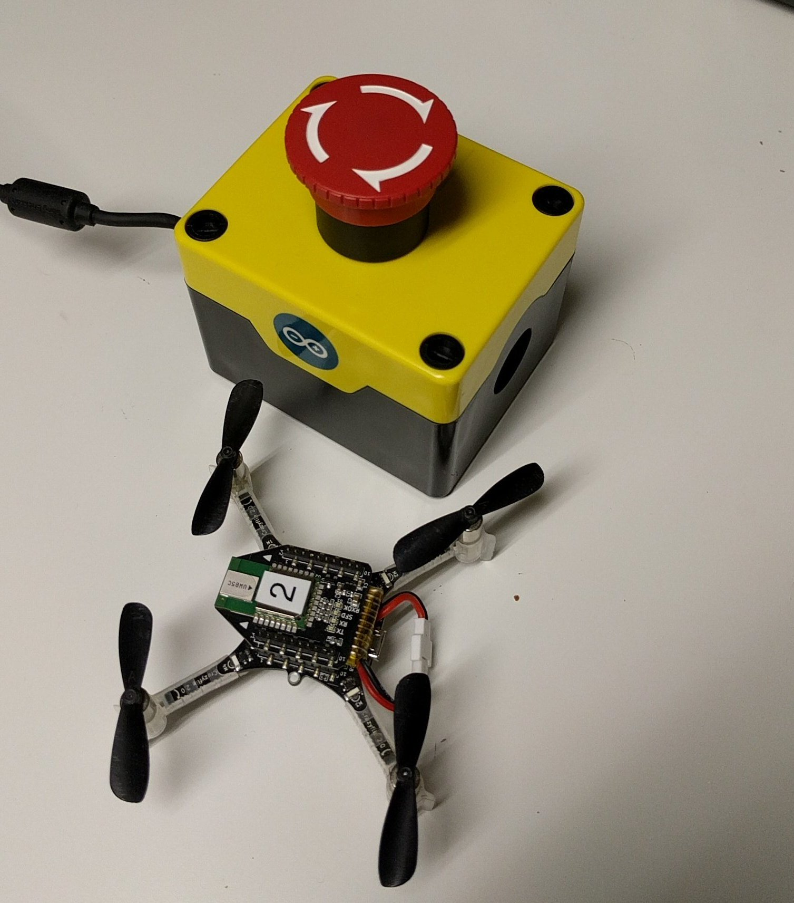

USB Emergency Stop button Arduino
=================================

This code requires the Joystick library from https://github.com/MHeironimus/ArduinoJoystickLibrary
It will run on Arduino/Genuino Leonardo and Micro (and other compatible boards).

Connect the E-stop button between Ground and the digital pin 9.

Designed to work with a normally-close E-stop button:

It is recognized by the computer as a joystick. Button 0 of the joystick
represent the state of the button: 0 is released, 1 is pushed.
